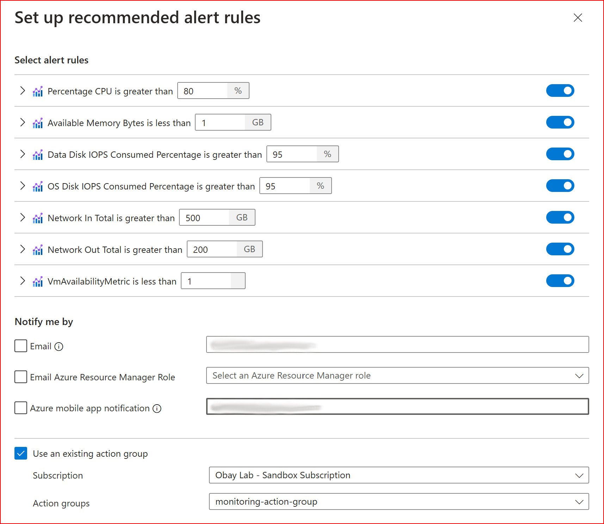

# terraform-azurerm-recommended-alerts

A Terraform module to create recommended alerts for Azure Virtual Machines.




## Usage

```hcl
module "linux_vm_alerts" {
  source                              = "obay/recommended-alerts/azurerm"
  version                             = "0.0.5"
  vmname                              = azurerm_linux_virtual_machine.monitoring_linux_example_vm.name
  monitoring_scope                    = azurerm_linux_virtual_machine.monitoring_linux_example_vm.id
  monitoring_resource_group_name      = azurerm_resource_group.monitoring_rg.name
  monitoring_action_group_id          = azurerm_monitor_action_group.monitoring_action_group.id
}
```

## Alert Descriptions

1. **Available Memory Alert**
   - Triggers when available memory falls below the specified threshold
   - Default threshold: 1GB

2. **Data Disk IOPS Consumed Percentage Alert**
   - Triggers when data disk IOPS consumption exceeds the specified threshold
   - Default threshold: 95%

3. **Network In Total Alert**
   - Triggers when the total network input exceeds the specified threshold
   - Default threshold: 500MB

4. **Network Out Total Alert**
   - Triggers when the total network output exceeds the specified threshold
   - Default threshold: 200MB

5. **OS Disk IOPS Consumed Percentage Alert**
   - Triggers when OS disk IOPS consumption exceeds the specified threshold
   - Default threshold: 95%

6. **Percentage CPU Alert**
   - Triggers when CPU usage exceeds the specified threshold
   - Default threshold: 80%

7. **VM Availability Alert**
   - Triggers when VM becomes unavailable
   - Default threshold: 1

## Contributing

Contributions are welcome! Please feel free to submit a Pull Request.

## License

This project is licensed under the MIT License - see the LICENSE file for details.
